<!--- ------------------------------------------------------------------------------------------------------------------------------------------------------ -->
<!--- -- Custom Designed Banner ---------------------------------------------------------------------------------------------------------------------------- -->
<!--- ------------------------------------------------------------------------------------------------------------------------------------------------------ -->


<!--- ------------------------------------------------------------------------------------------------------------------------------------------------------ -->
<!--- -- Visitor Badge + Links ----------------------------------------------------------------------------------------------------------------------------- -->
<!--- ------------------------------------------------------------------------------------------------------------------------------------------------------ -->

<div align="center">
  
  <br><br>
  <a href="https://linkedin.com/in/www.linkedin.com/in/rajat-parihar-681097306"></a>
  <a href="https://dev.to/rajat128"></a> 
  <a href="https://hashnode.com/@rajat128"></a> 
  <!-- <a href="https://rajat-parihar.vercel.app/"></a> -->
  <a href="mailto:pariharrajat078@gmail.com"></a>
</div>

<br>

<!--- ------------------------------------------------------------------------------------------------------------------------------------------------------ -->
<!--- -- About ME  --------------------------------------------------------------------------------------------------------------------------------------- -->
<!--- ------------------------------------------------------------------------------------------------------------------------------------------------------ -->

<div align="center">

## 👋 Hi, I'm Rajat Parihar

### Full Stack Developer | AI Enthusiast | Competitive Programmer

[](https://leetcode.com/CUxwlFCbOg/)
[](https://www.codechef.com/users/rajatp128)
[](https://github.com/rajat12826)

</div>

<br>

<details open>
<summary><b>📖 More About Me</b></summary>
<br>

```yaml
name: Rajat Parihar
location: Nagpur, Maharashtra, India
education:
  institution: Shri Ramdeobaba College of Engineering and Management
  degree: B.Tech in Computer Science & Engineering
  duration: Aug 2023 - May 2027
  cgpa: 9.52/10.0
  

experience:      
  - role: Full Stack Developer Intern
    company: Aezire (R&D / Product Development)
    period: May 2025 - Dec 2025
    highlights:
      - Developed scalable real-estate portal
      - Built comprehensive property search with advanced filters
      - Responsive architecture for mobile and desktop

key_projects:
  LC Interview Buddy:
    description: SaaS Coding Platform with 1,800+ algorithmic problems
    tech_stack: [Next.js 15, Monaco Editor, Gemini AI, DodoPayments]
    features:
      - AI Tutor for real-time hints & debugging
      - Premium subscriptions with webhook integration
      - State optimization with Zustand
      
  RBU AI Interviewer:
    description: Voice-enabled interview platform
    tech_stack: [Next.js 14, Supabase, Web Speech API, jsPDF]
    features:
      - Bidirectional voice interaction
      - Chat with Document (resume parsing)
      - Automated PDF scorecards generation

achievements:
  - Completed JP Morgan Chase & Co. Software Engineering Job Simulation
  - Solved 500+ algorithmic problems across LeetCode, HackerRank, CodeChef
  - Active contributor to open source projects

interests: [Web Development, AI/ML, System Design, Competitive Programming]
```

</details>

<br>

<!--- ------------------------------------------------------------------------------------------------------------------------------------------------------ -->
<!--- -- GitHub Activity Graph & Calendar ------------------------------------------------------------------------------------------------------------------ -->
<!--- ------------------------------------------------------------------------------------------------------------------------------------------------------ -->
| 📈 Activity Graph | 🗓️ 3D Contribution Map |
| :--- | :--- |
||  |


<!--  -->


<br>

<!--- ------------------------------------------------------------------------------------------------------------------------------------------------------ -->
<!--- -- Skills Section ------------------------------------------------------------------------------------------------------------------------------------ -->
<!--- ------------------------------------------------------------------------------------------------------------------------------------------------------ -->

# Technical Arsenal  

| Category        | Skills        |
|-----------------|---------------|
| **Languages** |   <!---->      <!---->  |
| **Frameworks & Libraries** |      |
| **UI Libraries & Styling** |      |
| **Databases** |     |
| **ORMs & Query Tools** |   |
| **State Management & Forms** |     |
| **Authentication & Security** |   |
| **APIs & Communication** |    <!--  --> |
| **Cloud & Deployment** | <!-- -->    |
| **Developer Tools & Services** |  [](https://github.com/rajat12826)     |
| **Code Quality** |   |
| **AI & Integration Tools** |       |
| **Competitive Programming** | [](https://leetcode.com/anmol4coder/) [](https://auth.geeksforgeeks.org/user/anmolbaranwal119) [](https://www.codechef.com/users/anmol119) [](https://www.hackerrank.com/) |
| **Learning Platforms** | [](https://www.coursera.org/user/69e4ae79233b116200019fb3f9111083)    |
<br>

## 📊 Computer Science Fundamentals

<table>
<tr>
<td width="50%">

### Data Structures
- Arrays & Linked Lists
- Stacks & Queues
- Trees
- Graphs & Hash Tables
- Heaps 

</td>
<td width="50%">

### Algorithms
- Dynamic Programming
- Sorting & Searching
- Graph Traversal (DFS, BFS)
- Greedy Algorithms
- Divide & Conquer

</td>
</tr>
</table>


<br>

<!--- ------------------------------------------------------------------------------------------------------------------------------------------------------ -->
<!--- -- Featured Projects --------------------------------------------------------------------------------------------------------------------------------- -->
<!--- ------------------------------------------------------------------------------------------------------------------------------------------------------ -->

# 🚀 Featured Projects

<details open>
<summary><b>💼 View My Work</b></summary>
<br>

### 🎯 LC Interview Buddy
**SaaS Coding Platform** | [Live Demo](https://lc-interview-buddy.vercel.app/) | [Source Code](#)


- 🎓 **1,800+ curated algorithmic problems** with Monaco-based code editor
- 🤖 **Google Gemini 1.5 Flash AI Tutor** providing real-time hints, debugging, and complexity analysis
- 💳 **Premium subscriptions** via DodoPayments with secure webhook integration
- 📊 **Progress tracking** with Recharts analytics and submission streaks
- ⚡ **State optimization** using Zustand for lag-free editor performance

---

### 🎤 RBU AI Interviewer
**Voice-Enabled Interview System** | [Live Demo](https://rbuaiinterveiw-xl88.vercel.app/) | [Source Code](#)


- 🗣️ **Bidirectional voice interaction** using Web Speech API for natural conversations
- 📄 **Chat with Document** feature parsing resumes with react-pdftotext
- 🎯 **Context-specific questions** generated from curriculum and uploaded documents
- 📋 **Automated PDF scorecards** using jsPDF for detailed feedback
- 🔐 **Clerk authentication** with role-based access control

---

</details>


<br>

<!--- ------------------------------------------------------------------------------------------------------------------------------------------------------ -->
<!--- -- GitHub Stats -------------------------------------------------------------------------------------------------------------------------------------- -->
<!--- ------------------------------------------------------------------------------------------------------------------------------------------------------ -->

# 📈 GitHub Statistics

<div align="center">
  
 [](https://git.io/streak-stats)

</div>

<br>

<!--- ------------------------------------------------------------------------------------------------------------------------------------------------------ -->
<!--- -- GitHub Metrics ------------------------------------------------------------------------------------------------------------------------------------ -->
<!--- ------------------------------------------------------------------------------------------------------------------------------------------------------ -->

# 📊 Detailed Metrics

<details>
  <summary><b>🔍 Click to expand comprehensive metrics</b></summary> 
  <br>

| Overview | Follow up Issues & PRs |
|:--------:|:-------------------------:|
|  |  |
| **Leetcode Stats** | **Notable Contributions** |
|  |  |
| **Achievements** | **Language Activity** |
|  |  |
| **Discussions** | **Reactions** |
|  |  |

</details>

<br>

<!--- ------------------------------------------------------------------------------------------------------------------------------------------------------ -->
<!--- -- Trophies ------------------------------------------------------------------------------------------------------------------------------------------ -->
<!--- ------------------------------------------------------------------------------------------------------------------------------------------------------ -->

<!--# 🏆 GitHub Trophies

<div align="center">
  


</div>


<br> -->

<!--- ------------------------------------------------------------------------------------------------------------------------------------------------------ -->
<!--- -- Achievements & Certifications --------------------------------------------------------------------------------------------------------------------- -->
<!--- ------------------------------------------------------------------------------------------------------------------------------------------------------ -->

# 🎖️ Achievements & Certifications

<table>
<tr>
<td width="50%">

### 🏅 Professional Simulations
- **JP Morgan Chase & Co.** Software Engineering Job Simulation (Dec 2025 - Jan 2026)
  - Kafka Integration
  - H2 Database Integration
  - REST API Development
  - Controller Implementation

</td>
<td width="50%">

### 💻 Competitive Programming
- **500+ Problems Solved**
  - LeetCode: Active
  - CodeChef: Active
  - HackerRank: Active
  - GeeksforGeeks: Active
- Focus: DSA, DP, Graph Algorithms

</td>
</tr>
</table>

<br>

<!--- ------------------------------------------------------------------------------------------------------------------------------------------------------ -->
<!--- -- Connect Section ----------------------------------------------------------------------------------------------------------------------------------- -->
<!--- ------------------------------------------------------------------------------------------------------------------------------------------------------ -->


<!--- ------------------------------------------------------------------------------------------------------------------------------------------------------ -->
<!--- -- Snake Animation ----------------------------------------------------------------------------------------------------------------------------------- -->
<!--- ------------------------------------------------------------------------------------------------------------------------------------------------------ -->


<br>

<!--- ------------------------------------------------------------------------------------------------------------------------------------------------------ -->
<!--- -- Footer -------------------------------------------------------------------------------------------------------------------------------------------- -->
<!--- ------------------------------------------------------------------------------------------------------------------------------------------------------ -->

<div align="center">

### 💭 _"First, solve the problem. Then, write the code."_ – John Johnson

